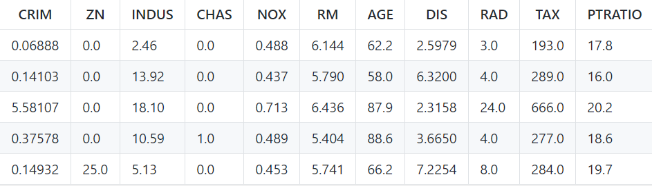

# Real Estate House Price Prediction : Model Building

Real estate house pricing is a well known phenomenon in current scenarios. Based on the area where the house is, decoration, construction the price always varies. And these feature list is pretty big what actually effects the price. In the end when a customers budget and expectation matches with the price of the house then a deal takes place. But it is really hard to consider all these ever changing features. Machine learning can help to tackle this problem efficiently. Today we shall try to build up a model. A model is a well defined programmable agent, whose main goal is to improve its performance based on the available features. In our case the performance that we want to improve is the house price and the features are, crime rate, zones , industrial, nitric oxides concentration, average number of rooms per dwelling, age, distance to major 5 working ground, distance to high way , TAX, pupil teacher ratio, lower status of population. If we represent all this in a table then it looks something like this,

!

As we can see all the feature values are converted to numerical values. More over the house price that we are going to estimate/ predict is also a numerical value like the price can be $x and $x can be any decimal value. To simplify things lets consider all the features as y. Based on the features y the price $x will vary. Simply we want to figure out for how much of change to y , x will vary. We want to find the relation between them. And in this particular case this relation is our model that will take the features y and map the output to $x price. 

Now lets try to formulate an equation so that it can give us the prediction in lament terms. we know for sure that $x is not equal to y. Its like saying crime rate is not the house price, Its obvious right. But x and y are related. Crime rate can influence house price and that is practical. If we want to present this mathematically we can present like this alpha*$x = y. We know crime rate can influence house pricing but exactly how much it influences is the alpha. Now there is a big problem. We have no dependency value for alpha. Actually this is the value that predetermine with the other known values from each row entry from the table. Like if crime rate is 0.0689% and for that the price is $200 then in simplest form the alpha will be like 200/0.0689(say this value is m). Simple right? Now we have the value for alpha. So far what we did is well known as the training phase of the simple model. This model is well known as linear regression and presented in the simplest term possible. Now the model is ready to predict and the equation is like this, y/m = $x. Now we know alpha that is m. For every new entry in the future we shall need to know the crime rate and for that the house price will be crime rate aka y multiplied by alpha which value is m. Now from this model we can get the value $x the house price that we are looking for. Simple is't it? Actually this is not this simple. For each feature like crime rate this proces goes on and in the end many feature variables arise like y1, y2, y3 .... And at the end all the equations are combined to one only. In between there is a loss function that determines the loss. And at the very end we get the coefficients like alpha which maps the new values in the future. 

This is just the simplified article but you may want to explore more interesting part for those please checkout [this](
https://github.com/gitrifatjahanazad/house-price-or-rent-prediction)
